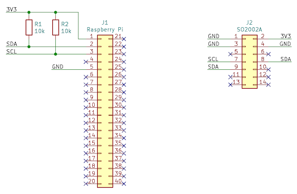

# SO2002A-message-board

This small thing turns [Akizuki's SO2002A](https://akizukidenshi.com/catalog/g/gP-08279/) into a message board with a simple Web UI.

## wiring



## start server

```bash
python3 app.py
```